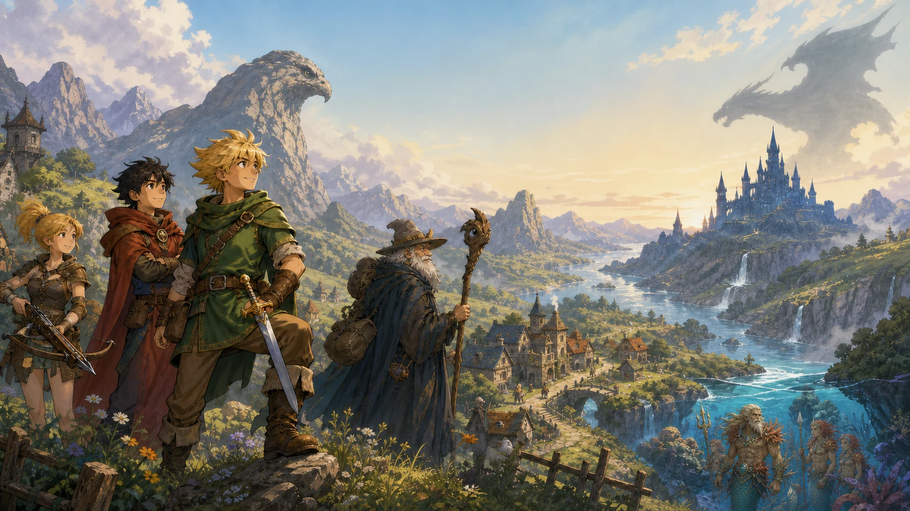
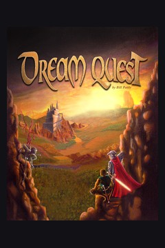
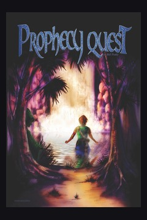
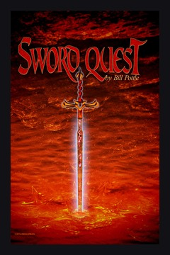
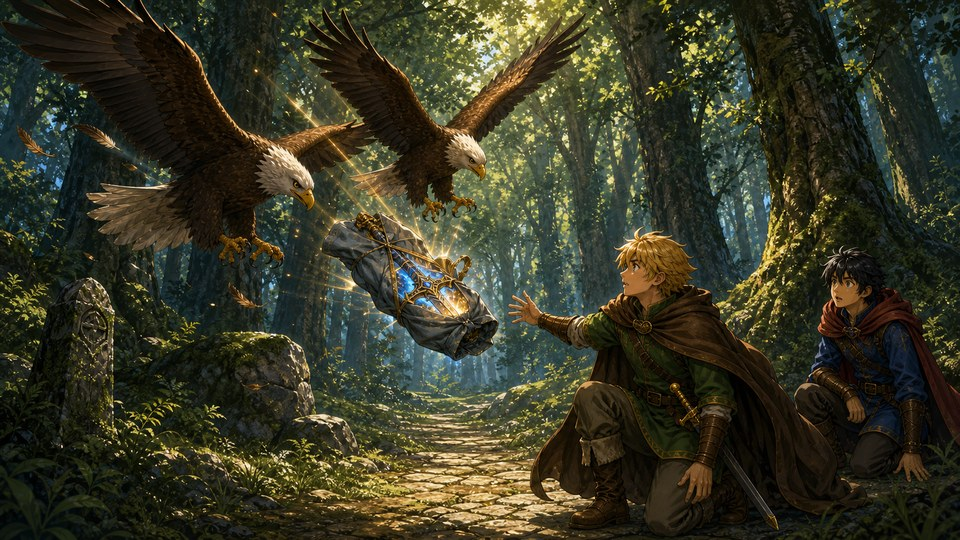
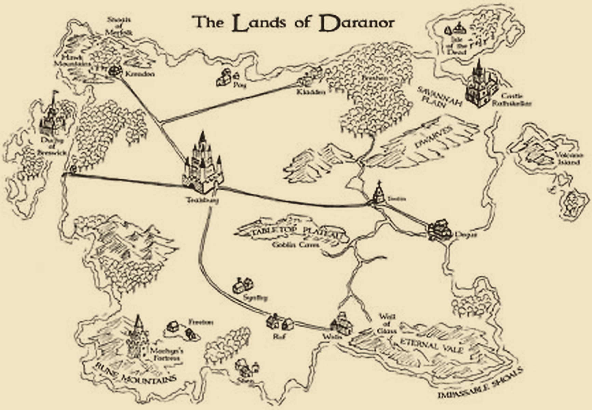

# Daranor RPG

<p align="center">
  <a href="https://pottlebooks.com/dqrpg/">
    
  </a>
</p>

<p align="center">
  <strong>Two connected fantasy role-playing adventures set in the Lands of Daranor.</strong>
</p>

<p align="center">
  <a href="https://pottlebooks.com/dqrpg/"><strong>▶ Choose a game and play online</strong></a>
  <br>
  <sub>No installation needed — play in a modern desktop or mobile browser.</sub>
</p>

## Play online

Visit [PottleBooks](https://pottlebooks.com/) or go straight to the [Daranor RPG game page](https://pottlebooks.com/dqrpg/) to choose an adventure. You can also jump directly into a campaign:

<table>
  <tr>
    <td align="center" width="33%">
      <a href="https://pottlebooks.com/dqrpg/dreamquest/">
        
      </a>
    </td>
    <td align="center" width="33%">
      <a href="https://pottlebooks.com/dqrpg/prophecy-sword/">
        
      </a>
    </td>
    <td align="center" width="33%">
      <a href="https://pottlebooks.com/dqrpg/prophecy-sword/">
        
      </a>
    </td>
  </tr>
  <tr>
    <td align="center">
      <strong>Book I</strong><br>
      <a href="https://pottlebooks.com/dqrpg/dreamquest/"><strong>Play DreamQuest</strong></a><br>
      Begin Tarthur's journey across Daranor.
    </td>
    <td align="center">
      <strong>Book II</strong><br>
      <a href="https://pottlebooks.com/dqrpg/prophecy-sword/"><strong>Play ProphecyQuest</strong></a><br>
      Follow the prophecy into a larger adventure.
    </td>
    <td align="center">
      <strong>Book III</strong><br>
      <a href="https://pottlebooks.com/dqrpg/prophecy-sword/"><strong>Continue into SwordQuest</strong></a><br>
      Complete the combined sequel campaign.
    </td>
  </tr>
</table>

ProphecyQuest and SwordQuest are presented together as one continuous sequel campaign.

## About the games

Daranor RPG adapts the Daranor trilogy as two browser games powered by one shared engine, interface, and asset library. Explore towns, castles, caverns, and wilderness; recruit a party; uncover side quests; and fight turn-based battles through the complete story.

<p align="center">
  <a href="https://pottlebooks.com/dqrpg/dreamquest/">
    
  </a>
</p>

## Explore the Lands of Daranor

<p align="center">
  <a href="https://pottlebooks.com/dqrpg/">
    
  </a>
</p>

## Saves and bug reports

Your progress is stored in your browser. The games also support JSON save export and import, which is the safest way to back up progress or move it to another browser.

Found a problem? Please use the [bug report form](https://github.com/billpottle/daranor-rpg/issues/new?template=bug.yml). Include the game, browser, device, and steps that reproduce the issue. Save files and screenshots are helpful but optional.

## For developers

This monorepo contains DreamQuest, the combined ProphecyQuest/SwordQuest sequel campaign, and their shared game engine, interface, asset library, build system, and test harness. The website is the primary way to play, and each campaign can also be built as a self-contained folder for offline use.

### Run locally

Requirements:

- [Node.js](https://nodejs.org/) 22 or newer.
- Google Chrome or Chromium for the functional test suite.

No third-party npm packages are required.

```sh
npm run dev
```

This builds the project and serves the launcher at <http://127.0.0.1:4173/>. The individual games are available at:

- <http://127.0.0.1:4173/dreamquest/>
- <http://127.0.0.1:4173/prophecy-sword/>

Use a different port with:

```sh
npm run dev -- --port 8080
```

### Commands

| Command | Purpose |
| --- | --- |
| `npm run build` | Build the launcher and both self-contained games into `dist/`. |
| `npm run dev` | Build once, then serve `dist/` locally. |
| `npm start` | Serve an existing `dist/` build. |
| `npm run validate` | Build and validate both campaign data sets and runtime asset references. |
| `npm test` | Build, validate, and run both functional browser suites. |

`dist/` is generated and is not committed.

### Offline distributions

Run `npm run build`, then package either `dist/dreamquest/` or `dist/prophecy-sword/`. Each folder contains its own HTML, JavaScript, CSS, media, and an `asset-manifest.json` with file hashes. Serving the folder over local HTTP gives the most consistent browser behavior:

```sh
npm start
```

### Repository layout

```text
games/
  dreamquest/          DreamQuest campaign data and unique assets
  prophecy-sword/      ProphecyQuest/SwordQuest data and unique assets
packages/
  engine/              Canonical shared runtime
  ui/                  Canonical shared game interface and styles
  launcher/            Website launcher
shared/assets/         Runtime media shared by both campaigns
tests/                 Campaign-specific functional tests
tools/                 Dependency-free build, serve, migration, and validation tools
dist/                  Generated website and offline-ready outputs
```

Campaign story, maps, balance, encounters, and campaign-only media belong under `games/<campaign>/`. Runtime behavior belongs in `packages/engine/`; shared presentation belongs in `packages/ui/`; byte-identical media used by both games belongs in `shared/assets/`.

## Contributing

See [CONTRIBUTING.md](CONTRIBUTING.md). Shared engine changes should be tested against both campaigns.

## Licensing

This is a multi-license repository designed for public reuse:

- Shared software and tooling are available under the [MIT License](LICENSES/MIT.txt).
- Original story, campaign data, documentation, art, and audio are available under [Creative Commons Attribution 4.0 International](LICENSES/CC-BY-4.0.txt), subject to the scope and exceptions in [LICENSE.md](LICENSE.md).
- Third-party and AI-assisted material is described in [THIRD_PARTY_NOTICES.md](THIRD_PARTY_NOTICES.md) and [AI-ASSET-PROVENANCE.md](AI-ASSET-PROVENANCE.md).
